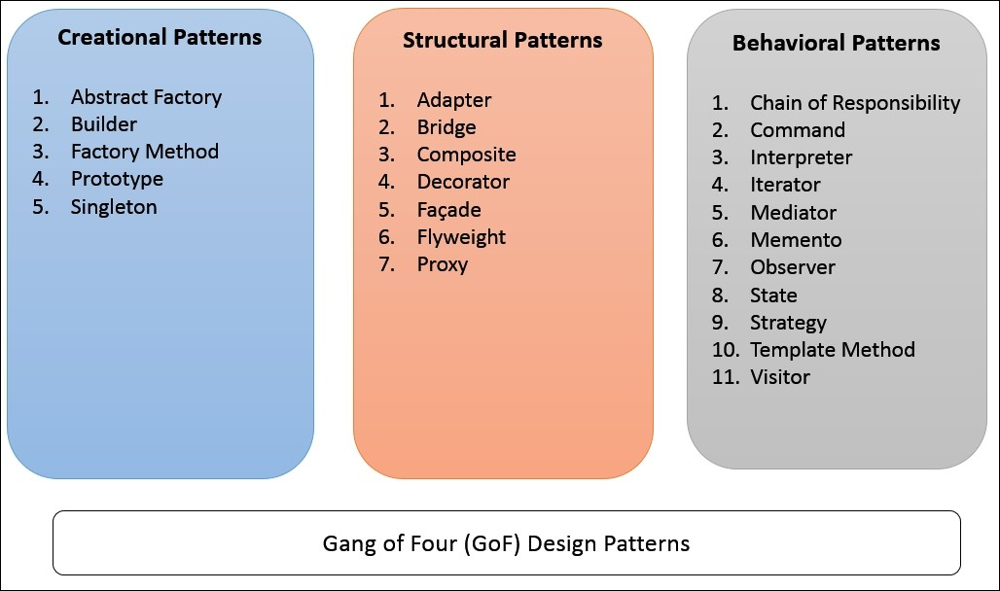

### Gang of Four
Design patterns are reusable, battle-tested solutions to problems that show up again and again in software development. Rather than reinventing the wheel each time a familiar problem appears, developers can reach for a pattern that is a proven structural approach that encodes decisions about how components relate, communicate, and manage their lifecycle. The concept was formalized by the "Gang of Four" in their 1994 book Design Patterns: Elements of Reusable Object-Oriented Software, which catalogued 23 patterns across creational, structural, and behavioral categories. Beyond saving time, patterns give teams a shared vocabulary: when someone says "we used a Singleton here," every experienced developer on the team immediately understands the intent and trade-offs without needing a line-by-line walkthrough.

### Manoa Study Spaces
In my final project for ICS 314, my team is building Manoa Study Spaces, a web application that helps UH Mānoa students discover, filter, and share campus study spots based on noise level, amenities, and availability. Design patterns have been central to keeping our Next.js codebase coherent across a team of five under a tight deadline. We use the Singleton pattern for our database connection, rather than creating a new Prisma client instance every time a component needs data, we instantiate it once and import that single shared instance wherever it's needed, avoiding performance issues and resource conflicts. We also rely on React's component pattern extensively: our study space cards, which display a location's name, photo, noise level, capacity, and amenity icons, are built as a single reusable component that accepts data as props, so the same card renders consistently whether it appears on the listing page, the favorites section, or the admin dashboard. Finally, the Observer pattern drives our filtering and search features: when a student selects a filter like "quiet" or "has outlets," that preference lives in React state, and every dependent component such as the space listing, the result count, the active filter indicators, it updates automatically without any manual wiring between them. Each of these patterns didn't just make the code cleaner. They made it legible to teammates picking up a feature mid-development, which in a five-person collaborative project is just as valuable as anything else.
