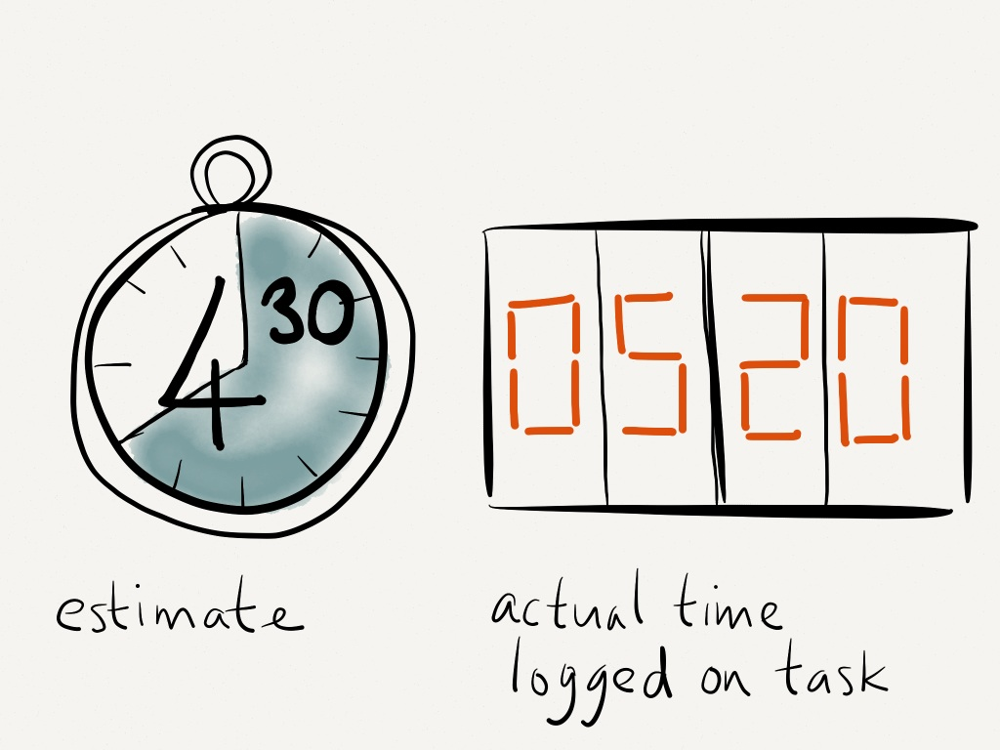

### Estimating Felt Like Guessing
At the beginning of this project, estimating effort felt like guessing. I didn’t have a strong sense of how long tasks would actually take, especially for features I had never implemented before. To make my effort estimates, I mainly based them on the type of task and my past experience working on similar features. For example, tasks like creating pages (such as the Home Page, Admin Page, and Listing Page) were estimated based on how long previous page implementations took. Simpler UI tasks were usually estimated lower, around 60–120 minutes, while more complex features like creating the login/signup system or database-related tasks were estimated higher, around 180–240 minutes.

I also broke down tasks mentally into smaller steps such as setting up the structure, implementing functionality, and testing. For example, when estimating the “Creating the User Login and Signup page” issue, I considered both frontend work and backend integration, which led me to give it a higher estimate. Additionally, for database-related tasks like creating schemas and linking profile data, I accounted for the extra complexity of making sure everything connected correctly. My estimates were based on a combination of prior experience, perceived complexity, and how many components were involved in completing the task.

### Why Estimating Still Helped
Even though my estimates were not always accurate, estimating in advance was still helpful. It forced me to think more carefully about what each issue actually required before starting. For example, when estimating tasks like “Create Add Space Page” or “Create Listing Page,” I initially focused on just building the UI, but estimating made me realize I also needed to consider data handling, testing, and edge cases.

Estimating also helped me prioritize tasks. Larger estimates, like the login/signup page (240 minutes), signaled that I should start earlier or dedicate more focused time to it. Even when I underestimated tasks, having an initial estimate gave me a baseline to adjust from as I worked. Estimating helped with planning and gave structure to how I approached each issue, even if the numbers were not perfectly accurate.

### What the Actual Effort Showed Me
Tracking actual effort was very useful because it showed clear differences between estimated and actual time. For example, in Milestone 2, the sub-issue “Linked Profile Creation to Signup Page” was estimated at 120 minutes but actually took 240 minutes of coding effort. This showed me that integration tasks tend to take longer than expected, especially when multiple components need to work together.

I also noticed that non-coding effort was significant. For example, “Created Data Model in Schema for Profile Images” only took 40 minutes of coding but required 60 minutes of non-coding effort, likely due to planning and understanding how to structure the schema. Similarly, some tasks like “Homogenize Repo” had a large amount of non-coding effort compared to coding.

These patterns helped me realize that I was consistently underestimating debugging, integration, and planning time. As a result, I would adjust future estimates by adding more buffer time, especially for tasks involving backend logic or multiple connected features.

### Tracking My Time (and Its Limitations)
To track my effort, I recorded the time (Google Timer/Stopwatch) I spent working on each issue and separated it into coding and non-coding effort. Coding included writing code, debugging, and testing, while non-coding included planning, researching, and figuring out how to approach problems.

While I tried to be accurate, my tracking was not perfect. There were times when I forgot to record time immediately or included small breaks without realizing it. However, I consistently updated my effort after working sessions, so I believe my data is a fair representation of my work. This process made me more aware of how I actually spend my time.

### What I Would Do Differently
If I were to do this again, I would improve my estimation process by using actual past data more directly instead of relying mostly on intuition. For example, I would look at how long similar issues actually took (such as page creation or database integration) and use those numbers to guide future estimates.

I would also improve my tracking by being more consistent with timing both coding and non-coding work in real time. Instead of estimating after the fact, I would use a timer more consistently to capture smaller chunks of work more accurately.

Additionally, I would break down larger issues into smaller, more specific tasks. This would make both estimation and tracking easier and more precise, especially for complex features like authentication and database integration.

### AI Use
I used AI tools such as ChatGPT, Claude, and Copilot to assist with understanding concepts, debugging issues, and helping generate code for certain features. For example, I used AI when linking profile data to the signup process, as well as for general React and backend-related questions.

A typical prompt I used was something like: 
“How do I connect a signup form to a database?”

In terms of time spent:
Prompt engineering: about 5–10 minutes per task
Generation time: usually less than 1 minute
Verification and debugging: around 20–60 minutes depending on the task

Most AI generated outputs were not used directly without changes. I often had to modify the code to fit my project structure and debug issues that came up during integration. In many cases, the time spent verifying and fixing the AI output was longer than the time spent generating it.

I'd say AI was helpful for speeding up understanding and providing a starting point, but it still required significant effort to ensure the final implementation worked correctly.
