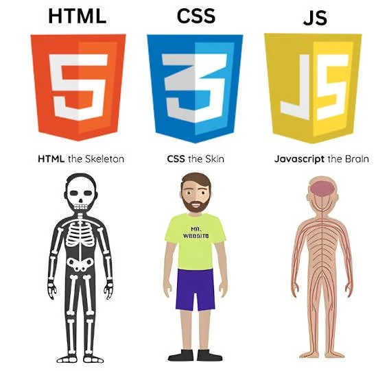

"Simplicity is prerequisite for reliability." — Edsger W. Dijkstra
 
Is It Worth It?
Learning Bootstrap 5 takes time. There are a lot of classes to remember, and at first it's hard to know which ones to use or how to combine them. It's a fair question to ask: why not just write plain HTML and CSS instead?
The answer is that Bootstrap solves some real, recurring problems in web development — and once you understand what those problems are, the framework starts to make a lot more sense.
What Bootstrap Actually Does for You
The biggest benefit is responsiveness. Making a layout that looks good on a phone, a tablet, and a desktop requires media queries and careful CSS. Bootstrap's 12-column grid handles this with a few class names. It's not magic, but it does save a significant amount of work.
There's also consistency. Without a design system, spacing, colors, and component styles tend to drift across pages — especially on larger projects or when multiple people are working on the same codebase. Bootstrap gives everyone a shared set of defaults to work from.
Finally, there's speed. Pre-built components like navbars, modals, and form styles mean you're not reinventing those things from scratch every project. That time adds up.
The Learning Curve Is Real — But It Levels Off
At first, Bootstrap felt like too much to keep track of. There are hundreds of utility classes, and it takes a while to build up familiarity with which ones are useful and why.
After a few projects, though, the classes start to become second nature. More importantly, working within Bootstrap's structure encourages better habits: thinking about layout before writing code, organizing HTML more clearly, and planning for how elements will behave on smaller screens.
It also just gets faster over time. Work that used to take an afternoon starts taking an hour. That's the practical payoff for the initial time investment.
When Bootstrap Isn't the Right Choice
Bootstrap doesn't fit every project. If a design has very specific or unconventional visual requirements, working around Bootstrap's defaults can take more effort than starting from scratch. It also adds some file size, which matters for performance-sensitive pages.
Tailwind CSS is a popular alternative that takes a similar utility-class approach but generates only the CSS you actually use, which solves the bundle size problem. Semantic UI uses more descriptive class names like ui primary button instead of btn btn-primary — a different style that some developers prefer for readability.
The right framework depends on the project and the team. There's no universal answer.
Conclusion
UI frameworks like Bootstrap 5 are worth learning because they solve real problems: responsive layouts, visual consistency, and faster development. The upfront learning cost is real, but it pays back over time — both in speed and in the design habits it encourages.
Raw HTML and CSS are never going away, and understanding them deeply is still important. But for most projects, a framework like Bootstrap provides a solid foundation that's faster to build on and easier to maintain than starting from zero every time.
