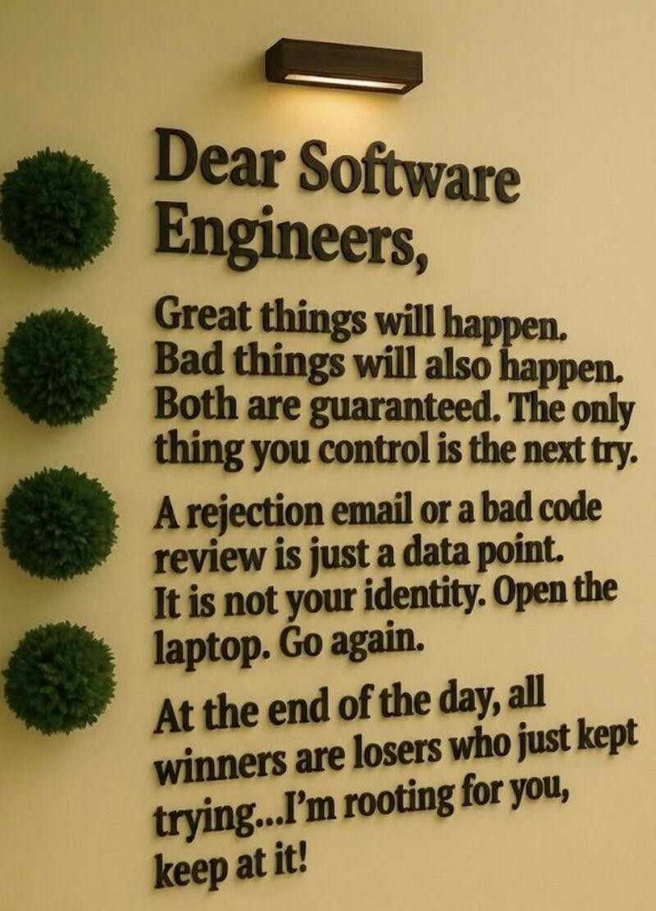

### Introduction
Artificial Intelligence has become an important part of modern software engineering education. In ICS 314, AI tools such as ChatGPT and GitHub Copilot were often used as learning assistants for debugging, understanding concepts, and improving code. These tools do not replace the learning process, but instead reshape how students approach problem-solving.
In this course, I used AI mainly as a support tool for understanding React, JavaScript, debugging errors, and learning new concepts faster. It helped reduce confusion when starting new tasks, but it also made it clear that real understanding still comes from hands-on practice, reading documentation, and breaking things down manually.

### Personal Experience with AI
**Experience WODs**
 
For WODs, I sometimes used AI to understand errors instead of writing full solutions. A typical prompt was: “Why is my function not returning the expected output in JavaScript?”
AI helped me identify possible issues quickly, but I still had to implement and test the solution myself. The time pressure of WODs made it important not to rely too heavily on AI, since real learning came from struggling through the problem.

**In-Class Practice WODs**
 
During practice WODs, I used AI more freely for debugging. It helped explain errors and suggest fixes, especially when working with unfamiliar syntax. However, I noticed that depending on it too early sometimes slowed my ability to recognize patterns on my own.

**In-Class WODs**
 
For graded WODs, I wanted to test my own understanding first. After completing my attempt, I sometimes used AI to compare solutions or verify if my logic made sense.

**Essays**
 
For essays like this one, I used AI to help organize ideas and improve structure. However, I always rewrote everything in my own voice because AI-generated writing alone felt too generic.

**Final Project**
 
For the final project, I worked on the User Profile and User Login/Signup Page for our “Manoa Study Spaces” application. My role focused on building features that allow users to create accounts, log in securely, and personalize their profiles with information like their major, classes, study preferences, and favorite study spots.

Going into this, I never really had experience with React until this class, so the process was challenging. I relied on a combination of AI, documentation, and trial-and-error. AI helped me get started and provided structure, but it rarely worked perfectly on the first try. I still had to read documentation, debug errors, and figure out how everything connected. There were times where I spent over two hours debugging a single issue that AI could not fully solve. 

AI did not replace the work but rather supported it. For someone experienced in React, these problems might take 10–15 minutes, but for me, they took much longer because I was still learning the fundamentals. That gap showed me that AI cannot replace real understanding.
Overall, AI was helpful as a starting point and debugging assistant, but the most important learning came from breaking things, fixing them, and trying again. It reinforced the idea that AI is just a tool, and real growth comes from actively working through problems.

**Learning a Concept / Tutorial**
 
This was one of the most useful uses of AI. I often asked complex topics to make it easier to understand quickly, especially when documentation felt too dense.

**Answering Questions in Class or Discord**
 
Before answering questions, I sometimes used AI to confirm my understanding. It helped me participate more confidently, but I still verified answers before sharing them.

**Asking or Answering Smart Questions**
 
I never really used AI to help me or improve how I asked questions. However, I can see it being used to help others communicate technical issues more clearly.

**Coding Examples**
 
I used AI for examples and modified them to fit my assignment. This helped me learn faster, but I still had to practice it manually to fully understand it.

**Explaining Code**
 
I used AI to break down code like, “Explain this function step by step.” This was helpful for understanding unfamiliar or complex logic, especially with callbacks and nested functions.

**Writing Code**
 
I sometimes used AI to generate starting points. However, I rarely used the output directly. I rather treat it as a reference and modify it.

**Documenting Code**
 
AI was useful for generating comments and documentation. It helped speed up repetitive tasks like explaining functions, but I always made sure to check.

**Quality Assurance**
 
I used AI to debug ESLint errors. It helped me understand scoping and import issues, but I still had to fix and test the code myself.

**Other Uses**
I use AI as a study tool for reviewing concepts before exams and quizzes. I also use it to help format, brainstorm, and organize ideas for projects.

**III. Impact on Learning and Understanding**
 
AI significantly improved my ability to start and debug problems quickly. It reduced frustration when stuck, but it also created a risk of relying on it too early.
One important realization was that understanding comes from struggle. When I tried problems first and used AI only after, I learned more deeply. AI worked best as a guide, not a solution provider.

**IV. Practical Applications**
 
Outside of ICS 314, AI is useful in real-world software development for debugging, prototyping, and documentation. It speeds up development and helps teams work more efficiently. However, human validation is still necessary because AI can produce incorrect or incomplete solutions.

**V. Challenges and Opportunities**
 
A major challenge is over-reliance on AI, which can reduce independent problem-solving. Another issue is that AI sometimes gives confident but incorrect answers.
An opportunity is teaching students how to critically evaluate AI output instead of just using it. This would make AI a stronger learning tool rather than a shortcut.

**VI. Comparative Analysis**
 
Traditional learning builds stronger foundational understanding through practice and repetition. AI-enhanced learning provides faster explanations and debugging support. Traditional methods are better for deep learning, while AI is better for efficiency. The best approach is combining both.

**VII. Future Considerations**
 
AI will likely become a standard part of software engineering workflows. Future developers may rely on AI tools daily for coding assistance.
The challenge for education will be ensuring students still learn core problem-solving skills instead of depending entirely on AI.

**VIII. Conclusion**
 
AI played a major role in my ICS 314 experience as a learning and debugging tool. It helped me understand concepts faster and fix errors more efficiently, but it worked best when used alongside independent thinking. AI is not replacing the learning process, it is reshaping how we approach it. The key is learning how to use it effectively without losing the ability to think critically and solve problems independently.

