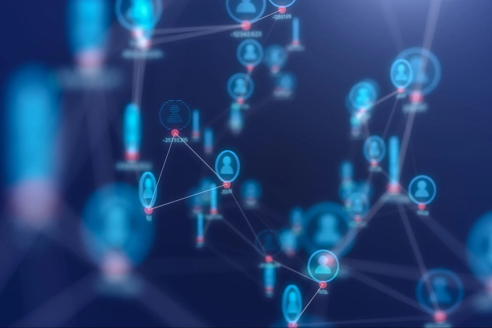

*"Your obligation is that of active participation. You should not act as knowledge-absorbing sponges, but as whetstones on which we can all sharpen our wits." — Edsger W. Dijkstra* 
 
# Why Computer Science? 
I would've never imagined myself to be on the path I am today. I was never really sure of what I wanted to be growing up. I knew what I enjoyed, I knew my strengths and weaknesses, and just like everyone in this world, I had desires of being successful and longed to be content with my life. For a while, I explored different paths, trying to figure out where I fit.

I must admit, I am not your typical "computer science major" in some ways. I don't love video games, I'm not the person who's been building computers, and I was never really drawn to tech growing up. In my free time, I actually urge to be away from any technology. I enjoy being out, meeting people, having a community, staying active, and honestly just disconnecting from screens altogether. But here's the thing. I do love problem-solving. I love math. I love learning. I love thinking, and thinking, and thinking, and overthinking. When I'm stuck on a problem, I can't let it go until I solve it. It bugs me, it keeps me up at night, and it won't leave my brain alone until I figure it out. So maybe I'm not as far from a "typical CS major" as I thought. When I tell people I'm studying computer science, I usually get confused looks. And I get it. On the surface, someone who wants to be away from screens studying computer science doesn't make sense. So now you may be wondering, why the heck am I pursuing computer science?

# Finding Purpose in Code
The turning point came when I started seeing technology differently. Instead of viewing it as something that pulls people apart, I began noticing how it could actually bring them together. I started paying attention to the apps and platforms around me that were genuinely making a difference. I saw apps organizing community clean uups and neighborhood events, bringing people out of their homes to actually meet each other. There were platforms connecting volunteers with local nonprofits, making it easy for people who wanted to help to find opportunities that matched their skills and schedules. I noticed running apps that weren't just tracking miles, they were building communities, helping beginners learn proper form, connecting runners with local groups, and keeping people motivated with challenges and encouragement. Food delivery apps were helping elderly or disabled folks access groceries they couldn't get themselves. Mental health apps were providing affordable therapy and support to people who couldn't afford traditional counseling. Language learning apps were opening up new opportunities for immigrants trying to build lives in a new country. I saw how a simple scheduling tool could transform chaos into coordination for a local food bank managing dozens of volunteers. How budgeting software was helping families take control of their finances and reduce the stress that comes with money struggles. How small businesses were using basic websites and social media to reach customers they never could have found before. Even something as simple as video calls was bridging distances, grandparents seeing their grandkids grow up, families staying close despite living states apart, friends maintaining connections that geography would have broken in another era. That's when it clicked for me. Technology isn't just about building the next big app or creating fancy features. It's about solving real problems for real people. I realized I could take everything I loved about connecting with others and building community, and channel that into creating tools that actually make a difference. Computer science became less about the computers themselves and more about what they could do for the world around me.

# Translating Between Worlds
I'm still learning. I don't have years of coding experience. But what I do have is something I think is just as important: I understand people. I know how to listen, how to figure out what someone actually needs versus what they say they need, and how to think about problems from different perspectives. Here's the thing I've realized about computer science. Our degree teaches you how to code, how to build algorithms, how to think technically, and you absolutely need these skills in a work environment. But what they don't really teach you is how to talk to people. How to sit in a meeting with non-technical stakeholders and actually understand what they're asking for. How to translate business needs into technical solutions. How to explain complex technical decisions to someone who doesn't know what an API is. That's where I think my background gives me an edge. I can talk to anyone, whether it's clients, team members, even the nerdy ones who'd rather be coding than in a meeting. I enjoy bridging that gap between the technical and business sides of things. When I'm learning to code, I'm constantly thinking about the end user and the bigger picture. Who's going to use this? Will it make sense to them? Is it actually solving their problem, or just adding another layer of complexity to their day? I'm naturally drawn to the human side of technology, like user experience, accessibility, and almost like designing systems that don't require a manual to understand. The tech world needs people who can code AND communicate, who understand that building great software isn't just about writing clean code, it's about understanding what needs to be built in the first place.

# The Bigger Picture
Moving forward, I want to build a solid technical foundation while keeping sight of why I got into this in the first place. Yes, I need to learn the fundamentals such as how to write clean code, how to debug when things inevitably break, etc. I'm working on getting comfortable with different programming languages and frameworks, understanding databases, and wrapping my head around how all these complex pieces fit together. But more than just collecting technical skills, I'm excited about applying this growing knowledge to meaningful projects. I want to explore how technology can contribute to social good, especially since it's constantly evolving and changing. There's so much potential in how software can address real inequities. I'm thinking about accessible interfaces that work for people with disabilities. Platforms that connect underserved communities to resources they need like healthcare, education, job opportunities. Systems that actually respect people's privacy instead of treating user data as a product to sell. Maybe I'll work on applications that help nonprofits run more efficiently, or tools that make education accessible to people who've been left out, or contribute to open-source projects serving communities that big tech ignores. I want to stay curious about new frameworks and tools not just because they're trendy, but because they might open up better ways to help people.

The technology landscape is always shifting, with new frameworks and approaches emerging all the time, and I want to stay curious about how these advancements can be directed toward actually helping people. My goal isn't to become a software engineer who just churns out features. I want to be someone who builds things that matter, who thinks critically about the impact of what I'm creating, and who uses technology as a force for positive change. I want to think critically about the impact of what I'm creating and not just "does this work?" but "should this exist?" At the end of the day, I want a career where I can look back and know my work made someone's life better. That's what would make all of this worth it.
