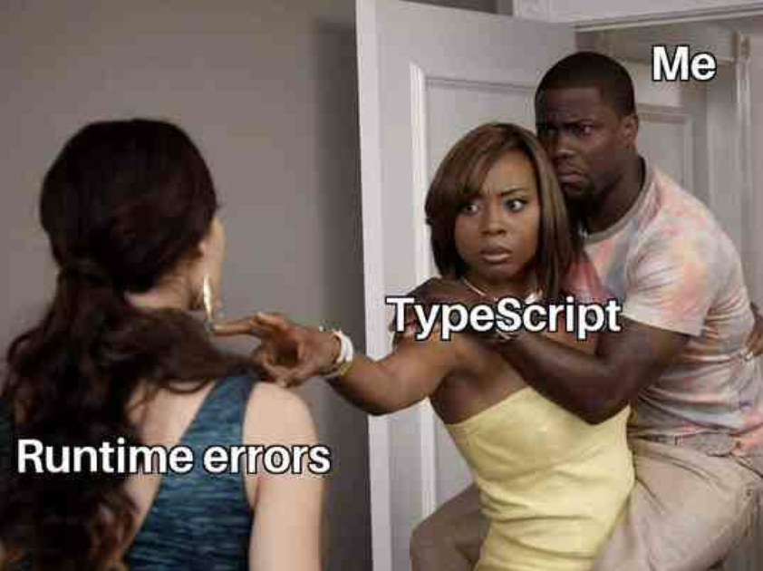

### Introduction

Coming from Java, C, C++, and a bit of Python, I wasn't sure what to expect from TypeScript. Another language to learn? Great. But here's the thing: I actually really like it. TypeScript catches bugs before they become problems, and after dealing with runtime errors in other languages, that's a game changer.

What surprised me most was how natural it felt to write. The syntax is clean and readable like Python, but it has the type safety I'm used to from Java and C++. I can write code quickly without constantly worrying about what's going to break when I run it. The compiler does the heavy lifting, where it catches type errors while I'm still writing, not after I've deployed something and it crashes. That alone makes it worth using.

After this module, I get why TypeScript has become so popular. It takes what's good about JavaScript and fixes what's frustrating about it. Let me break down why it works and what the learning experience was actually like.
 

### First Impression

When I first looked at TypeScript code, it reminded me most of Python. The syntax is straightforward. No unnecessary brackets or verbose declarations like Java requires. You can write a function in a few clean lines and actually read it without squinting. But unlike Python, where you don't know if something's broken until you run it, TypeScript tells you immediately if you're doing something wrong.

The type system felt familiar coming from Java and C++. I'm used to declaring types: int x = 5; in C, String name = "test"; in Java. TypeScript does the same thing: let x: number = 5; let name: string = "test"; But here's where it gets better... TypeScript has type inference. If you write let x = 5;, it knows x is a number. You don't have to spell everything out like you do in Java. It's smarter about it.

The weirdest part? Understanding that TypeScript isn't really a standalone language. It compiles or "transpiles" to JavaScript. In C++, you compile to machine code. In Java, you compile to bytecode. TypeScript becomes plain JavaScript that runs in browsers. At first, that felt like an extra, unnecessary step. Why not just write JavaScript? But once I realized this lets you use modern features while keeping your code compatible with older systems, it clicked. From a software engineering perspective, that's actually clever.

One thing I appreciate: the tooling. My IDE autocompletes everything, catches errors as I type, and suggests fixes. Coming from C++ where a missing semicolon means hunting through compiler errors, having feedback is very helpful. It makes writing code faster and way less frustrating.
 

### The Good Stuff: What I Actually Like

From a software engineering perspective, TypeScript solves a real problem. JavaScript's flexibility means you can assign a string to a variable that's supposed to be a number, pass wrong arguments to a function, or misspell property names and nothing stops you until the code crashes. TypeScript catches these mistakes before you even run the code.

The type checking is the biggest win. If I try to pass a string to a function expecting a number, TypeScript won't compile. Misspell a property? It tells me immediately. This prevents bugs from reaching production and makes code easier to understand. When someone reads my code, the types show exactly what each function expects and returns. I also learned modern JavaScript features through TypeScript. Arrow functions, destructuring, and template literals were new to me and make code cleaner and faster to write. Interfaces let you define object shapes without Java's class overhead, giving you structure without the verbosity.

Is TypeScript perfect? No. There's a learning curve with generics and knowing when to use strict typing. But compared to hunting runtime errors in JavaScript or dealing with Java's verbosity, TypeScript strikes a good balance. 
 

### Coding with a Time Bomb, but One Day I'll Reach Flow State

The time pressure changes everything. Normally, I can take my time debugging, look things up, think through logic carefully. With WODs, you don't have that luxury. You need to comprehend the problem fast, plan your approach, write clean code, and make sure it actually runs, all while the clock counts down. One small mistake, one syntax error, and you're scrambling to fix it before time runs out.

Is it useful? Honestly, I think so, even if it's uncomfortable. The pressure forces you to really know the material instead of relying on trial and error or constantly Googling syntax. You can't fake your way through a WOD. Either you understand TypeScript well enough to write working code under pressure, or you don't. It's pushing me to internalize concepts faster than I would otherwise.

Do I enjoy it? Not exactly. But I can see how it's building skills that matter, like speed, accuracy, and the ability to think clearly under stress. In real development, there are deadlines, production bugs that need fixing now, and situations where you can't spend an hour debugging. WODs simulate that pressure in a controlled way. Will this style work for me? I'm still figuring that out, but either way, it's defenitely a skill to develop and practice for job interviews.
 

### Return Statement

Looking back at this module, I learned more than just TypeScript syntax. I learned how to think faster, debug smarter, and appreciate a language that actually prevents problems instead of just documenting them. Error 404: Runtime bugs not found? Yeah, I'm okay with that. TypeScript has earned its spot in my toolkit, and I'm curious to see where it takes me next.
