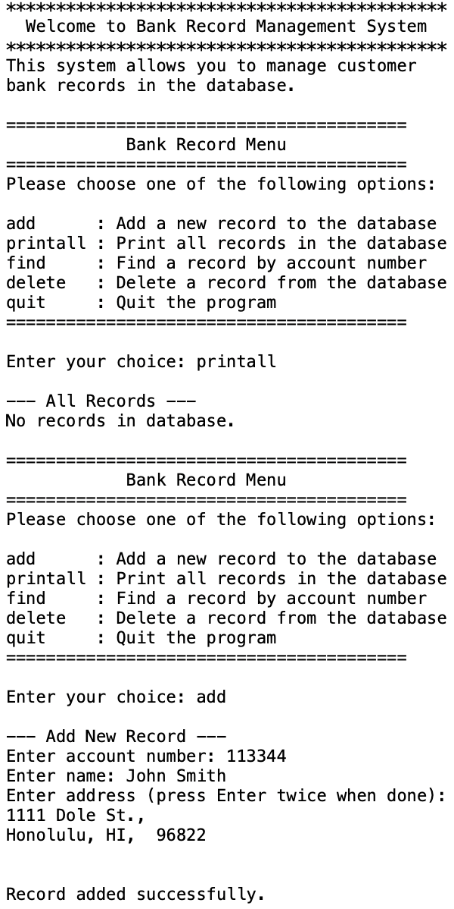

<div class="text-center p-4">
  
  
  
</div>

The Bank Record Management System is a command-line application that allows users to efficiently manage customer account information. The system stores customer records containing account numbers, names, and addresses in a sorted linked list structure, maintaining data persistence through file storage between sessions.

This project demonstrates object-oriented programming principles by encapsulating database operations within a custom `llist` class. The system maintains records in ascending order by account number, preventing duplicate entries and providing fast lookup capabilities. All records are automatically saved to a text file when the program exits and reloaded on startup, ensuring no data loss.

For this project, I implemented the complete C++ conversion from a previous C-based version, focusing on proper encapsulation, memory management, and C++ best practices. I designed the `llist` class with proper constructors, destructors, and operator overloading to handle deep copying of database objects. The implementation includes custom copy constructors and assignment operators to ensure proper memory management when copying database instances.

Key features include:
- Sorted linked list maintaining records in ascending order by account number
- Automatic file I/O for data persistence
- Input validation for account numbers and multi-line address entry
- Debug mode compilation option using preprocessor directives
- Full memory management using C++ `new` and `delete` operators

Here is some code that illustrates the sorted insertion algorithm:
```cpp
int llist::addRecord(int accno, char name[], char address[])
{
    record *newRecord;
    record *current = start;
    record *previous = NULL;

    // Find correct position in sorted list
    while (current != NULL && current->accountno < accno)
    {
        previous = current;
        current = current->next;
    }

    // Check for duplicate account number
    if (current != NULL && current->accountno == accno)
    {
        return -1;
    }

    // Insert new record at correct position
    newRecord = new record;
    newRecord->accountno = accno;
    strcpy(newRecord->name, name);
    strcpy(newRecord->address, address);
    newRecord->next = current;

    if (previous == NULL)
    {
        start = newRecord;
    }
    else
    {
        previous->next = newRecord;
    }

    return 0;
}
```

Source code: [GitHub Repository](https://github.com/judasco/bank-database)
---


