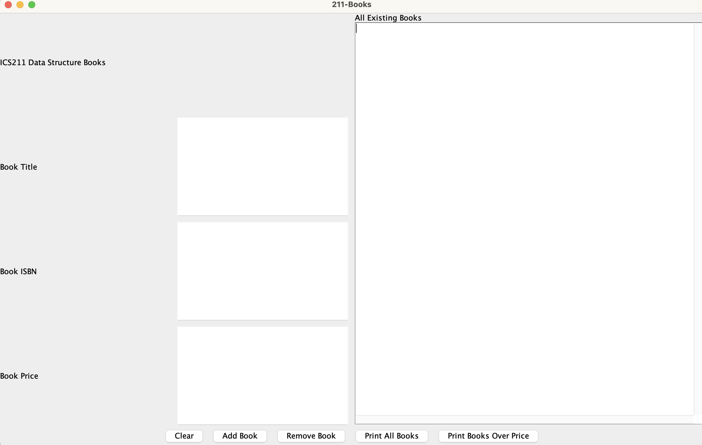

<div class="text-center p-4">
  
  
</div>

The Book List Manager is a graphical user interface (GUI) application built with Java that manages a collection of books using a custom sorted linked list data structure. The system allows users to add books with validated ISBN numbers (101-999), titles (minimum 5 characters), and prices ($0-$10,000), automatically maintaining the list in ascending order by ISBN. Users can remove books from the collection, view the complete inventory, and filter books by price threshold.

The application demonstrates advanced object-oriented programming principles including interface implementation, custom exception handling, and the Comparable interface. The core data structure is a singly-linked list that uses recursive algorithms for displaying all books and filtering books above a specified price. Each book is stored in a custom `NodeBook` class that maintains references to create the linked structure, while the `BookList` class manages insertion, deletion, and traversal operations.

For this project, I was responsible for implementing the complete linked list data structure including the `BookList` and `NodeBook` classes. I developed the recursive printing methods that traverse the list to display all books or filter by price without using loops. I also created the `Book` class with comprehensive validation logic and the custom `BookException` for robust error handling. Additionally, I designed and implemented the GUI using Java AWT/Swing components, organizing the interface with BorderLayout and GridLayout managers, and connecting user actions to the underlying data structure through event listeners.

Here is code that illustrates the recursive insertion-in-order algorithm for maintaining the sorted list:
```java
@Override
public boolean insertInOrder(Book b) {
    if (head == null) {
        head = new NodeBook(b, null);
        bookCount++;
        return true;
    }

    if (b.getISBN() == head.getBook().getISBN()) {
        System.out.println("Book already exists");
        return false;
    }

    if (b.getISBN() < head.getBook().getISBN()) {
        head = new NodeBook(b, head);
        bookCount++;
        return true;
    }

    NodeBook curr = head.getNext();
    NodeBook prev = head;

    while (curr != null) {
        if (b.getISBN() == curr.getBook().getISBN()) {
            System.out.println("Book already exists");
            return false;
        } else if (b.getISBN() < curr.getBook().getISBN()) {
            break;
        }
        prev = curr;
        curr = curr.getNext();
    }

    prev.setNext(new NodeBook(b, curr));
    bookCount++;
    return true;
}
```

And here is the recursive method for filtering books by price:
```java
private String printMoreThanPriceHelper(double price, NodeBook node) {
    if (node == null) {
        return "";
    }

    String rest = printMoreThanPriceHelper(price, node.getNext());

    if (node.getBook().getPrice() > price) {
        return node.getBook().toString() + "====================\n" + rest;
    } else {
        return rest;
    }
}
```

This project strengthened my understanding of linked list data structures, recursion, GUI event handling, and the importance of data validation in building robust applications. It also improved my ability to implement interfaces and design maintainable, object-oriented solutions.

Source: <a href="https://github.com/judasco/book-list-manager">github.com/judasco/book-list-manager</a>
