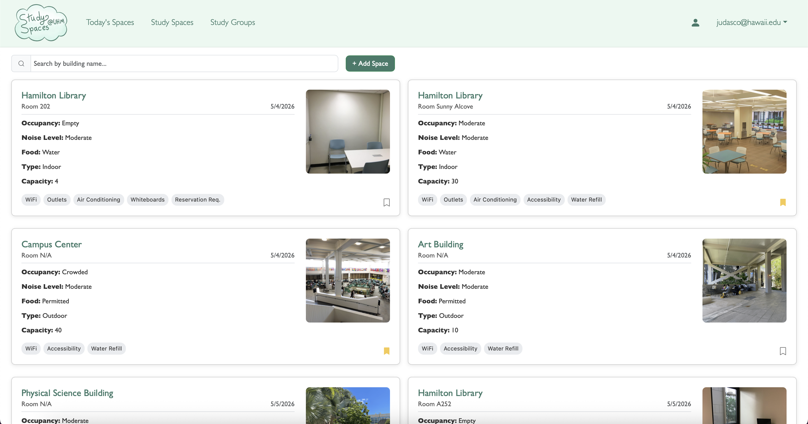
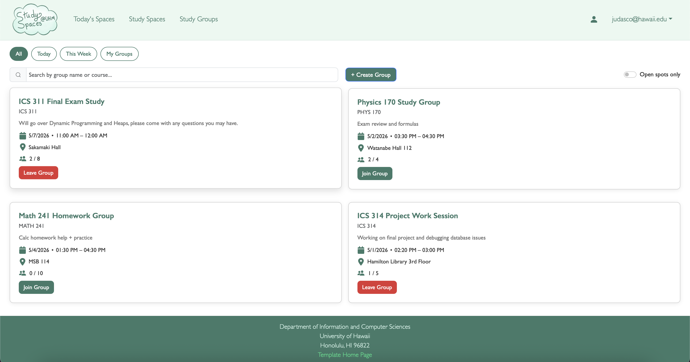
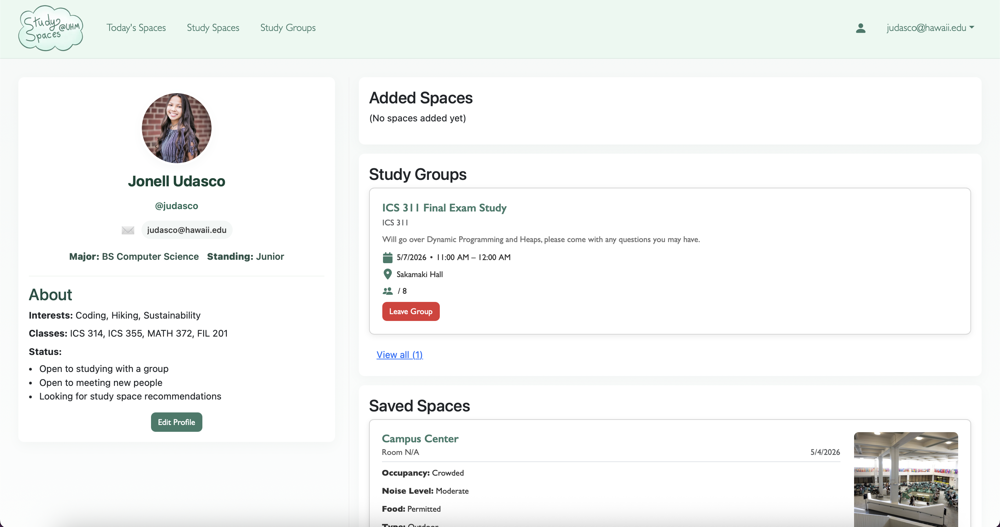

### The Problem

Finding a good place to study at UH Manoa is harder than it should be. Students often rely on word of mouth or just wander around hoping to find somewhere available. Newer students especially struggle since they may not even know where to look. My team built Manoa Study Spaces to give students a centralized place to discover, share, and save campus study spots while also coordinating study groups with their peers.

### Project Overview

Manoa Study Spaces is a full-stack web application built to help students at the University of Hawaii at Manoa find campus study spots that match their needs. Students can browse and filter locations by noise level, indoor/outdoor setting, and specific amenities like outlets, food access, or air conditioning. The platform also supports study group coordination, letting students create and join groups tied to specific spaces. The app is deployed on Vercel and was developed collaboratively by a five-person team over three milestones.

The problem we set out to solve is a familiar one on large campuses: newer students often don't know where to go when they need a quiet corner to study, a group meeting room, or a spot with reliable power outlets. Existing resources were scattered or outdated, so we built a centralized, community-driven solution. Users can submit new study spaces, rate and review existing ones, and bookmark favorites for quick access. Admins can moderate submissions, update space details, and monitor usage patterns to keep the data accurate.

The application has two primary user roles. **Admins** manage the overall content quality, they can approve or remove submitted spaces, edit amenity details, and manage user accounts. **Students** are the core users: they search and filter spaces, submit new locations, join study groups, and leave feedback through ratings and comments. Some spaces also display occupancy indicators to help students gauge how busy a location is before heading over.

### My Contributions

For this project, I was responsible for building the sign-up and login pages, which handle user authentication and route users into the app. I also designed and implemented the full user profile page, which brings together three key sections:

* **Added Spaces** — showing all the study spots the user has personally submitted
* **Study Groups** — listing every group the user has joined
* **Saved Spaces** — displaying locations the user has bookmarked

To support that last feature, I added a bookmark button directly to the space cards throughout the app, so users can save a space to their profile from the listing page with a single click.

### Pages

**Home Page**

**Study Spaces**

**Study Groups**

**User Profile**

### Challenges and Lessons

The biggest challenge of this project was not technical, it was keeping the team moving forward together. Throughout all three milestones, some team members were unable to finish their assigned issues on time, which meant others had to step in and pick up the remaining work on top of their own tasks. It was frustrating at times, especially when incomplete features blocked progress on other parts of the app.

This experience taught me how much a team project depends on everyone pulling their weight. When one person falls behind, it creates a ripple effect that impacts the whole team. Going forward, I have a much better understanding of how important it is to communicate early when something is taking longer than expected, rather than going quiet and letting a deadline pass. Clear expectations, regular check-ins, and accountability within a team matter just as much as the code itself.

Community feedback gathered at the end of the project also pointed to a few clear areas for improvement: toning down the color palette, combining the dual navigation bars into one, displaying group creator profiles on the study group page, and adding more granular filters to the space listing. These are all actionable items we documented for a potential future iteration of the app.

### My Takeaway

This project strengthened my experience with full-stack web development, collaborative Git workflows, and agile milestone planning. It also deepened my understanding of role-based access control, form validation, and designing interfaces around real user needs on a campus I know well.

Working in a team using GitHub also taught me a lot about staying organized across multiple contributors and communicating clearly to avoid stepping on each other's work.
